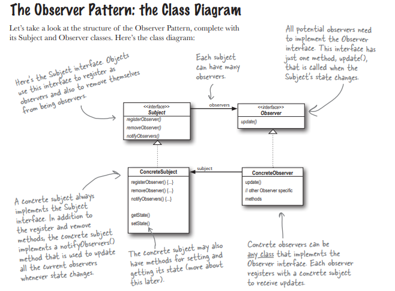
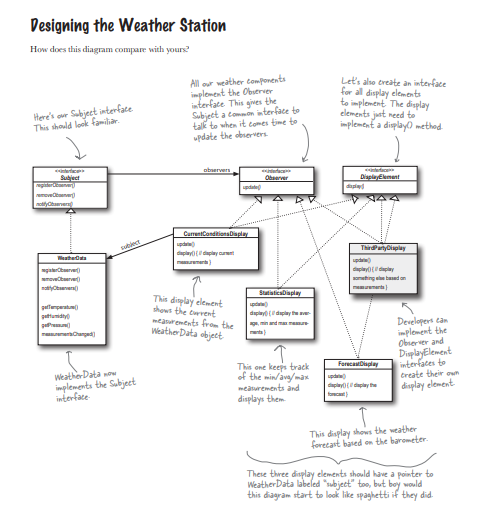

### Observer Pattern
The Observer Pattern is ideal for situations where an object (the Subject) needs to notify multiple other objects (the Observers) about changes to its state.

***The Observer Pattern defines a one-to-many object changes state, all of its dependents are notified and updated automatically***

#### Solution Using the Observer Pattern
Key Components
1. Subject Interface:
    Defines methods for attaching, detaching, and notifying observers.
2. Observer Interface:
    Defines the method that gets called when the Subject's state changes.
3. Concrete Subject:
    Implements the Subject interface and tracks its state.
4. Concrete Observers:
    Implement the Observer interface and update their display based on the Subject's state.

***There are a few different ways to implement the Observer Pattern, but most revolve around a class design that includes Subject and Observer interfaces**

#### The Observer Pattern: the Class Diagram

#### Desiging of a weather station
