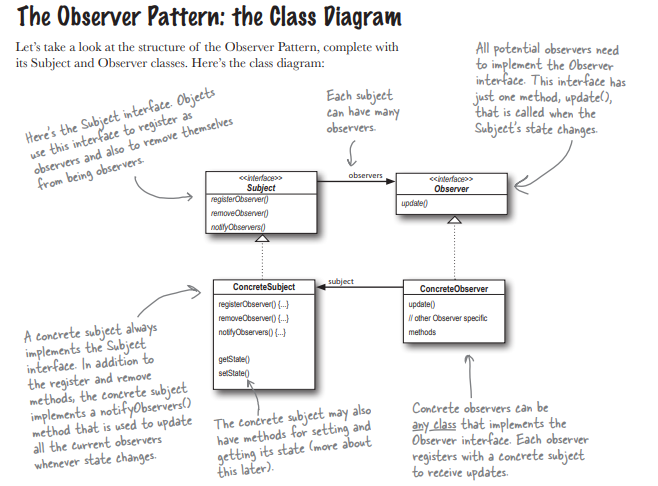
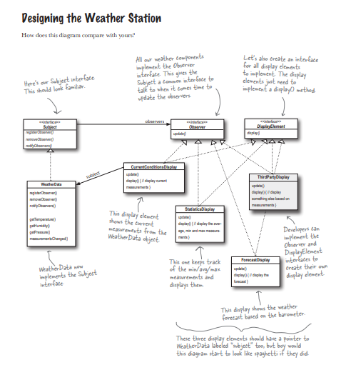

### Observer Pattern
The Observer Pattern is ideal for situations where an object (the Subject) needs to notify multiple other objects (the Observers) about changes to its state.

***The Observer Pattern defines a one-to-many object changes state, all of its dependents are notified and updated automatically***

#### Solution Using the Observer Pattern
Key Components
1. Subject Interface:
    Defines methods for attaching, detaching, and notifying observers.
2. Observer Interface:
    Defines the method that gets called when the Subject's state changes.
3. Concrete Subject:
    Implements the Subject interface and tracks its state.
4. Concrete Observers:
    Implement the Observer interface and update their display based on the Subject's state.

***There are a few different ways to implement the Observer Pattern, but most revolve around a class design that includes Subject and Observer interfaces**

#### The Observer Pattern: the Class Diagram

#### Desiging of a weather station

#### Key Concepts
1. Subject:
    The object being observed.
    Maintains a list of observers and notifies them of any state changes.
    Provides methods for attaching, detaching, and notifying observers.

2. Observer:
    The objects that are watching the subject.
    Define an interface or abstract class that declares an update() method, which is called when the subject's state changes.
Loose Coupling:

The subject and observers are loosely coupled. The subject doesn’t need to know the specific details of its observers, only that they implement the observer interface.

#### When to use Observer Pattern
1. When changes in one object need to trigger updates in dependent objects.
2. When there is a need to decouple the subject and its observers to make the system more flexible and maintainable.
Examples:
A news feed where subscribers are notified of updates.
A stock price tracker that updates multiple displays when the price changes.

### Structure
1. Subject Interface:
    Methods to attach, detach, and notify observers.

2. Concrete Subject:
    Maintains the state and implements the subject interface.

3. Observer Interface:
    A method to update the observer.

4. Concrete Observers:
    Implement the observer interface and define how they should respond to updates.